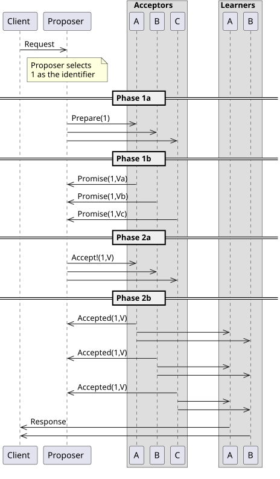

# Paxos Distributed System

Esse projeto é uma solução distribuída para o protocolo de consenso Paxos, utilizando docker-compose.

## Paxos

Paxos é um protocolo de consenso utilizado para garantir confiabilidade entre elementos de um cluster,
onde podem haver falhas ou sabotagens em algum elemento.

O protocolo divide os elementos do cluster em 3 funções: Proposers, acceptors e leaners.

veja: https://en-m-wikipedia-org.translate.goog/wiki/Paxos_(computer_science)?_x_tr_sl=en&_x_tr_tl=pt&_x_tr_hl=pt&_x_tr_pto=tc

Em suma:
- Proposers recebem requisições dos clientes e repassam-as para os acceptors com IDs de transação únicos
- Accepters, caso todos aceitem o mesmo ID de transação, repassam a requisição para os leaners
- Leaners realizam o consenso, aprendem o valor de transação, e realizam o commit no recurso R

## Distribuição

Cada elemento de um cluster é executado dentro de um container docker, todos comunicando entre si.
A organização dos containeres é realizada via docker-compose

## Executando o projeto
Veja instructions.txt

